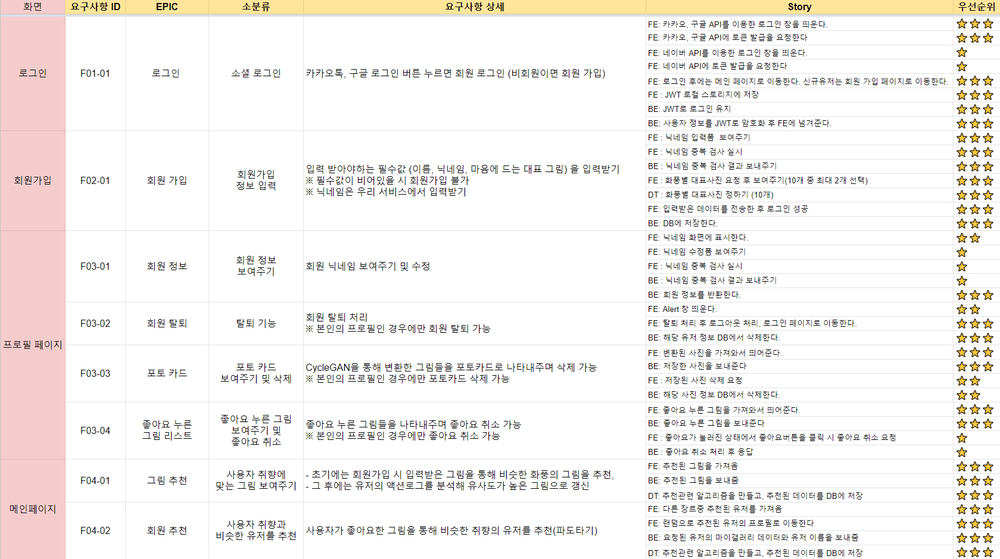
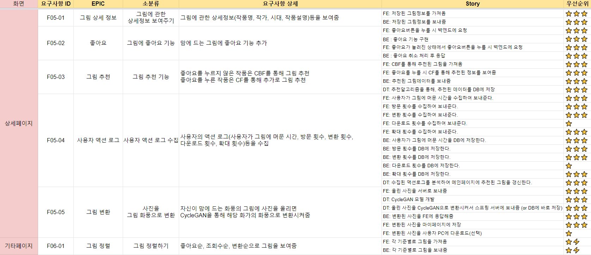
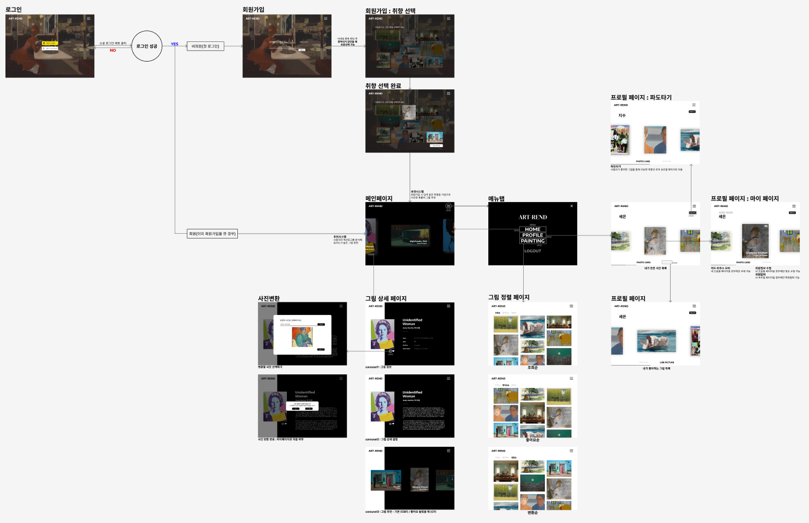

# :file_folder: C104 산출물

### 1. ERD

### 2. API 명세

[API 명세]: https://www.notion.so/API-61d60a99d9d54d2cb74dfc9a65e64b82

###### 자세한 정보는 노션 혹은 파일 내 이미지를 확인해 주세요.

- API명세(Notion) : https://www.notion.so/API-61d60a99d9d54d2cb74dfc9a65e64b82 

### 3. 요구사항 명세서

[요구사항명세서]: https://www.notion.so/83198543da8b41498ceded549b8eee6d

- [C104_요구사항명세서.pdf](C104.assets/C104_요구사항명세서.pdf) 

- 요구사항명세서(Notion) : https://www.notion.so/83198543da8b41498ceded549b8eee6d 

### 4. 데일리 스크럼 : WIKI

[Daily Scrum]: https://lab.ssafy.com/s07-bigdata-recom-sub2/S07P22C104/-/wikis/home

- 데일리 스크럼(GitLab : WIKI) : https://lab.ssafy.com/s07-bigdata-recom-sub2/S07P22C104/-/wikis/home

### 5. 와이어프레임(스토리보드) : Figma

[Wire-frame]: https://www.figma.com/file/tjGDPMXlK6lZYuDpp0LwNb?embed_host=notion&amp;kind=&amp;node-id=13%3A318&amp;viewer=1

- 와이어프레임(Figma) : https://www.figma.com/file/tjGDPMXlK6lZYuDpp0LwNb?embed_host=notion&amp;kind=&amp;node-id=13%3A318&amp;viewer=1 

### 6. Notion

[ART-REND]: https://www.notion.so/Artrend-ba713ec9cd7b44909374613f6d36074c

- Notion[ART-REND] : https://www.notion.so/Artrend-ba713ec9cd7b44909374613f6d36074c 

