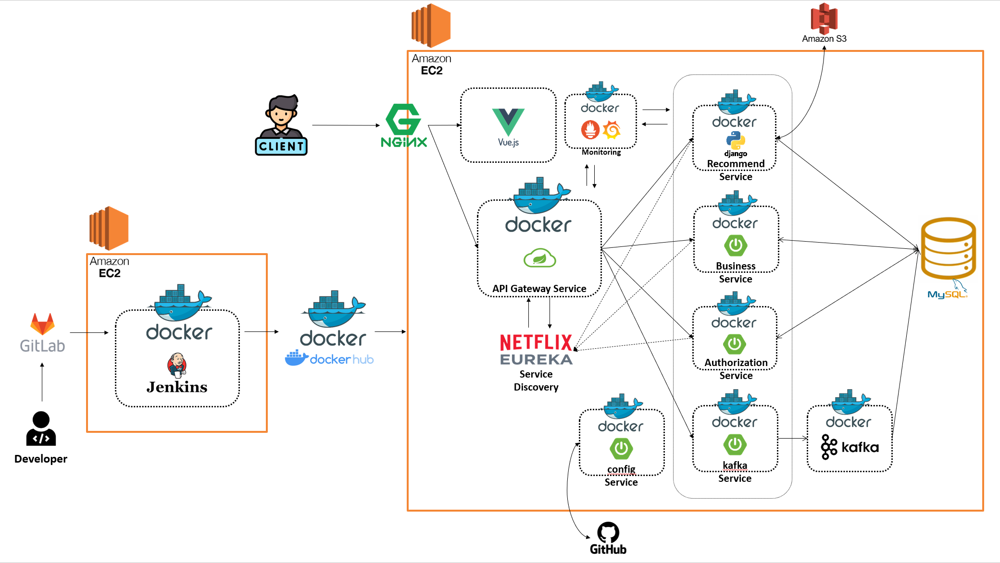
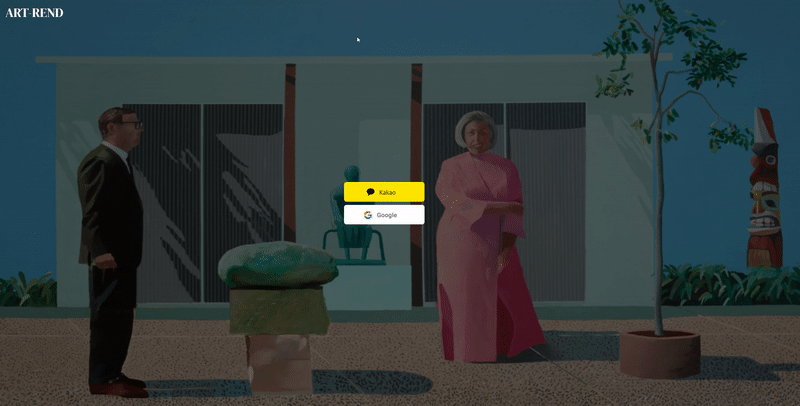
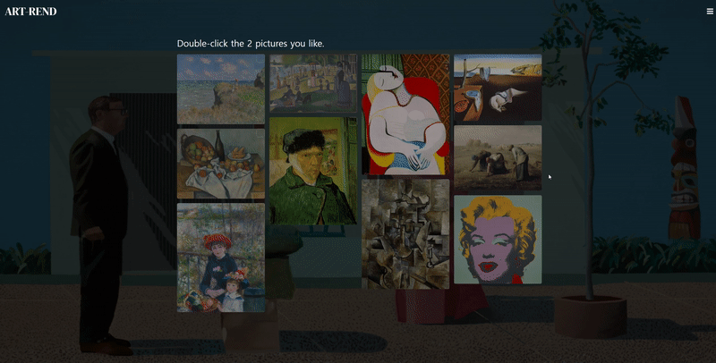
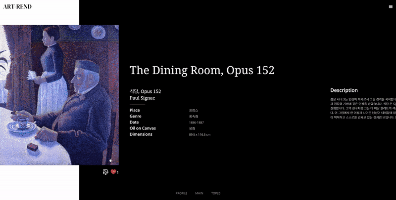
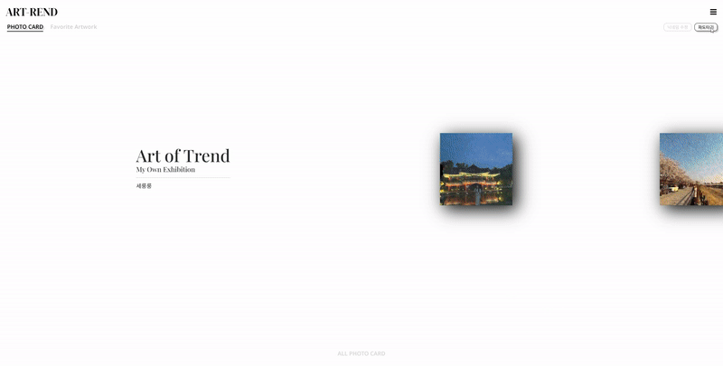
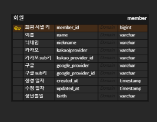
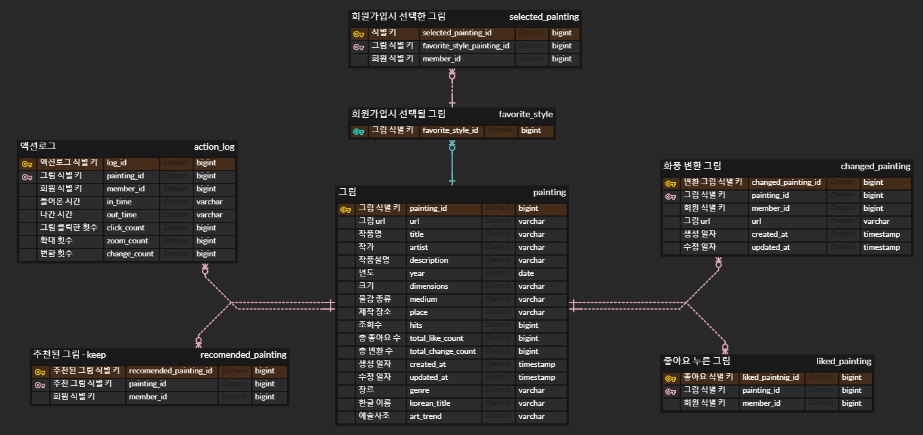

[TOC]

# 🏛ART-REND

 

 

## 💡웹 서비스 소개

> 미술 시장 실태 조사 시 2019년 3812억, 2020년 3291억 그리고 2021년에는 9223억 원으로 해가 가면 갈 수록 미술 시장 규모가 커져가고 있다. 또한 미술계에서 온라인 플랫폼이 성장하고 있는 추세이다. (아트프라이스, 아트넷, 아트시 등) 코로나 팬데믹 이후 아트페어의 OVR(온라인 뷰잉룸) 또한 증가 추세이다. 이렇게 커져가는 미술 시장 속에서 일반인들이 미술에 접하기는 쉬운일이 아니다. ART-REND는 예술에 관심을 가지기 시작한 사람들에게 예술에 대한 접근성을 높여주기 위해 만들어졌다.

#### :sparkling_heart: ART-REND만의 특별한 기능

1. 화가 / 장르 / 시대별에 따라 미니 전시회를 제공해준다.
2. 미니 전시회를 관람하면서 마음에 드는 그림을 내 프로필에 저장시킬 수 있다.
3. 나만을 위한 추천 시스템으로 좋아하는 그림과 사이트에서 나의 활동을 분석해 그림을 추천해준다.
4. 내가 마음에 드는 유명작가의 화풍으로 내 사진을 변환시켜준다. (Cycle GAN)
5. 좋아하는 그림과 변환시킨 그림들로 나만의 전시회를 꾸밀 수 있다.

이러한 여러 기능들을 통해 예술에 쉽게 접근할 수 있도록 도와주며, ART-REND 서비스 안에서 많은 그림들을 접하고 그림에 대한 정보를 제공해준다. 유저별 액션로그를 통해 차별화된 추천서비스를 제공하고 나만의 전시회를 통해 좋아하는 그림과 변환시킨 나만의 그림을 보여준다.

 

 

## 🛠️기술 스택

### 1. 기술 스택

#### 		Front-End

​	 

#### 		Back-End

​	

#### 		Data

​	

#### 		Infra

​	

#### 		IDE

​	

#### 		Tool

​	

 

### 2. 상세 버전

| OS             | Windows 10                 |                                              |
| -------------- | -------------------------- | -------------------------------------------- |
| **Front-End**  | HTML5                      |                                              |
|                | CSS3                       |                                              |
|                | JS(ES6)                    |                                              |
|                | Vue3                       | `5.0.8`                                      |
|                | Vuex                       |                                              |
|                | Node js                    | `16.16.0`                                    |
|                | NPM                        | `8.11.0`                                     |
| **Back-End**   | Java                       | `11`                                         |
|                | Spring Boot                | `2.7.3`                                      |
|                | Spring Data JPA            |                                              |
|                | Querydsl                   | `5.0`                                        |
|                | Spring Security            |                                              |
|                | Spring Cloud               |                                              |
|                | Gradle                     |                                              |
| **Data**       | Django                     | `3.2.12`                                     |
|                | Python                     | `3.9.13` (3.10 이상 사용시 torchvision 오류) |
|                | Pytorch                    | `1.12.1`                                     |
|                | scikit-learn               | `0.0.0`                                      |
|                | pandas                     | `1.4.2`                                      |
|                | numpy                      | `1.22.3`                                     |
| **Depolyment** | Docker                     |                                              |
|                | Jenkins                    |                                              |
|                | Nginx                      |                                              |
| **IDE**        | IntelliJ                   | `2022.1.3`                                   |
|                | Visual Studio Code         |                                              |
| **Database**   | MySQL                      | `8.0.29`                                     |
| **Server**     | AWS EC2 (Ubuntu 20.04 LTS) |                                              |
|                | AWS S3                     |                                              |
| **Tool**       | Figma                      |                                              |
|                | MySQL Workbench            |                                              |
|                | MobaXterm                  | `v22.1`                                      |
|                | Postman                    |                                              |
|                | Swagger                    |                                              |

 

### 3. 애플리케이션 구성도

|                            구성도                            |
| :----------------------------------------------------------: |
|  |

 

 

## ✨서비스 화면 및 주요기능

### 1. 로그인

- 소셜 로그인 (카카오 / 구글)

|                        **로그인**                         |
| :-------------------------------------------------------: |
|  |

 

### 2. 회원가입

- 이름 / 생년월일 입력
  - 이름과 생년월일이 같으면 계정 통합
- 닉네임 입력

|                        **회원 가입**                         |
| :----------------------------------------------------------: |
|  |

- 마음에 드는 그림 2개 선택
  - 메인 페이지 추천 그림에 반영

|                    **그림선택**                    |
| :------------------------------------------------: |
|  |

 

### 3. 메인페이지

- 회원가입 때 선택했던 그림을 바탕으로 그림 추천
- 사용자 액션로그를 바탕으로 그림 추천
  - 그림 클릭 횟수
  - 그림 확대 횟수
  - 그림에 머문 시간

|               **메인페이지**               |
| :----------------------------------------: |
|  |

 

### 4. 상세페이지

- 그림 정보 제공
  - 제목, 화가, 장르 등 그림에 관한 상세한 정보 제공

|                      **그림 정보 제공**                      |
| :----------------------------------------------------------: |
|  |

- 그림 추천 기능 (좋아요 유/무로 추천 시스템 변경)
  - 좋아요를 누르지 않았을 때 **(CBF)**
    - 상세페이지 그림 정보 기반 추천
  - 좋아요를 눌렀을 때 **(CF)**
    - 좋아요를 누른 다른 유저들의 데이터를 기반으로 추천
    - 데이터가 없을 경우 : CF와 CBF를 병합한 HF사용

|                      **그림 추천 기능**                      |
| :----------------------------------------------------------: |
|  |

- 그림 변환 (Cycle GAN)
  - 내가 선택한 사진을 마음에 드는 화가의 화풍으로 변환

|                        **그림** 변환                         |
| :----------------------------------------------------------: |
|  |

 

### 5. 프로필페이지

- Cycle GAN으로 변환시킨 나만의 포토카드와 좋아요 누른 그림 리스트 제공
  - 내 프로필에서만 포토카드 삭제 가능

|                 **내 프로필**                  |
| :--------------------------------------------: |
|  |

- 파도타기 기능
  - 랜덤으로 다른 유저의 페이지로 이동

|         **다른 유저의 프로필 (파도타기)**          |
| :------------------------------------------------: |
|  |

 

### 6. 랭킹페이지

- 조회순 / 좋아요순 / 변환순으로 TOP20 제공

|              **랭킹 페이지**               |
| :----------------------------------------: |
|  |

 

### 7. 그림 분류

- 화가별 / 장르별 / 시대별로 그림 분류

|               **화가별 페이지**                |
| :--------------------------------------------: |
|  |

|                     **장르별 페이지**                     |
| :-------------------------------------------------------: |
|  |

|                     **시대별 페이지**                     |
| :-------------------------------------------------------: |
|  |

 

 

##  👯‍♀️협업 관리

#### :ledger:[ Notion ]

#### :pencil2:[ GitLab ]

[Notion]: https://azure-drawbridge-1bf.notion.site/Artrend-ba713ec9cd7b44909374613f6d36074c
[GitLab]: https://lab.ssafy.com/s07-bigdata-recom-sub2/S07P22C104

 

 

## 📋프로젝트 관련 문서

#### 1. ERD (auth-service / business-service)

|                    **ERD : auth-service**                    |
| :----------------------------------------------------------: |
|  |

|                  **ERD : business-service**                  |
| :----------------------------------------------------------: |
|  |

#### 2. 와이어프레임(Figma)

|                   **와이어프레임(Figma)**                    |
| :----------------------------------------------------------: |
|  |
| 링크 : [와이어프레임(Figma)]([Story Board – Figma](https://www.figma.com/file/tjGDPMXlK6lZYuDpp0LwNb/Story-Board?node-id=0%3A1)) |

#### 3. 포팅매뉴얼

|                        **포팅매뉴얼**                        |
| :----------------------------------------------------------: |
| [포팅매뉴얼_ARTREND.pdf](/README.assets/포팅매뉴얼_ARTREND.pdf) |

#### 4. 시연 시나리오

|                      **시연 시나리오**                       |
| :----------------------------------------------------------: |
| [시연시나리오_ARTREND.pdf](/README.assets/시연시나리오_ARTREND.pdf) |

#### 5. 발표자료

|                        **발표자료**                         |
| :---------------------------------------------------------: |
| [발표자료_ARTREND.pdf](/README.assets/발표자료_ARTREND.pdf) |

 
